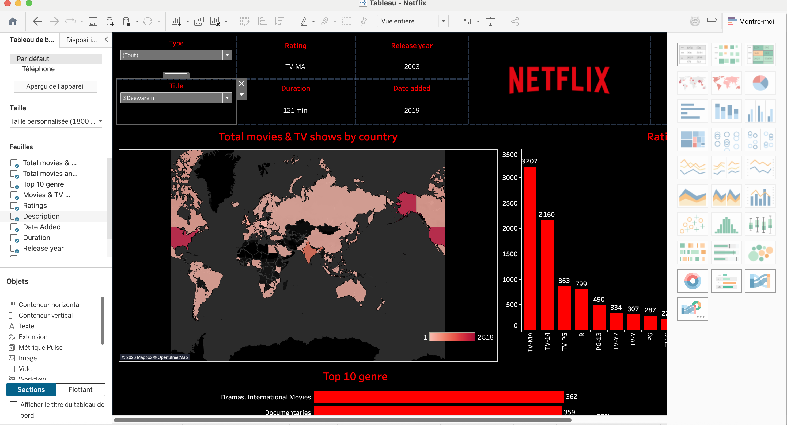
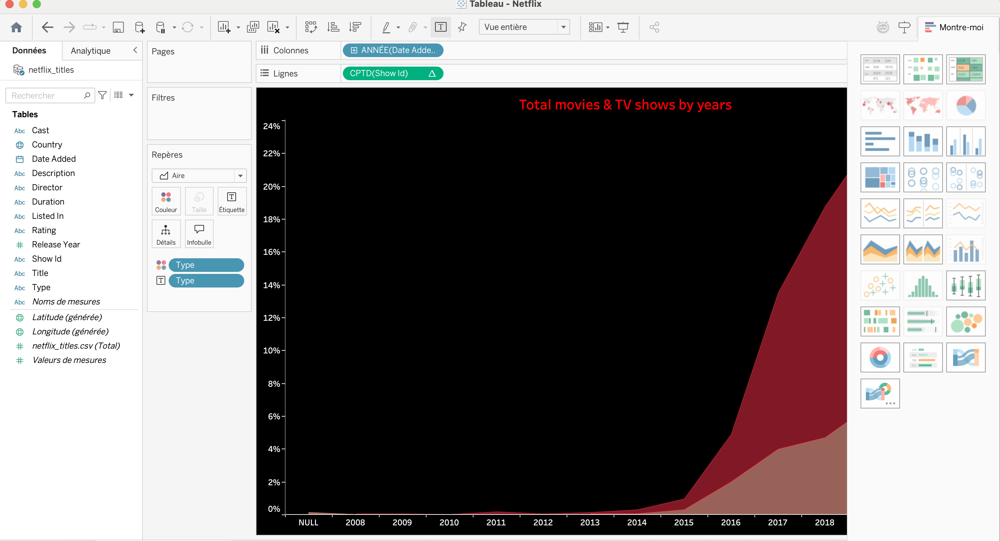
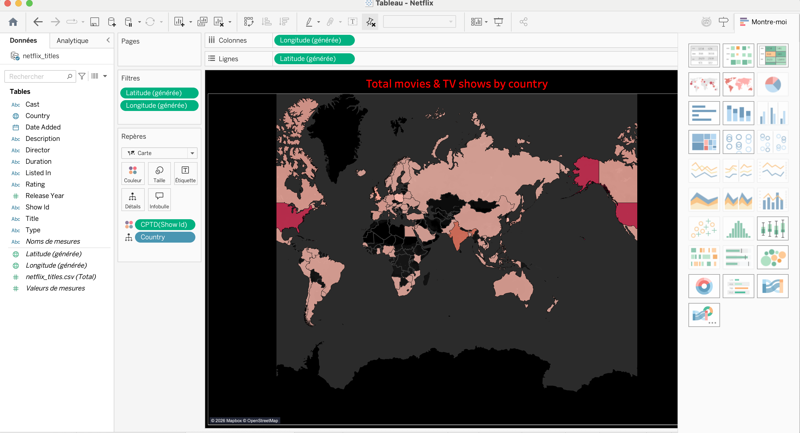
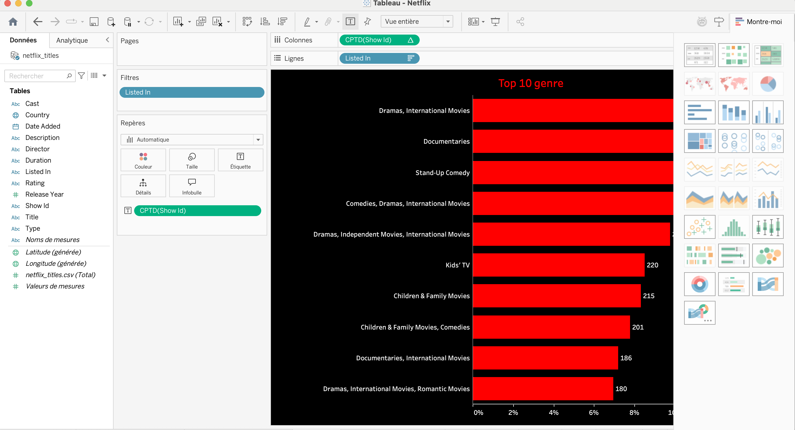
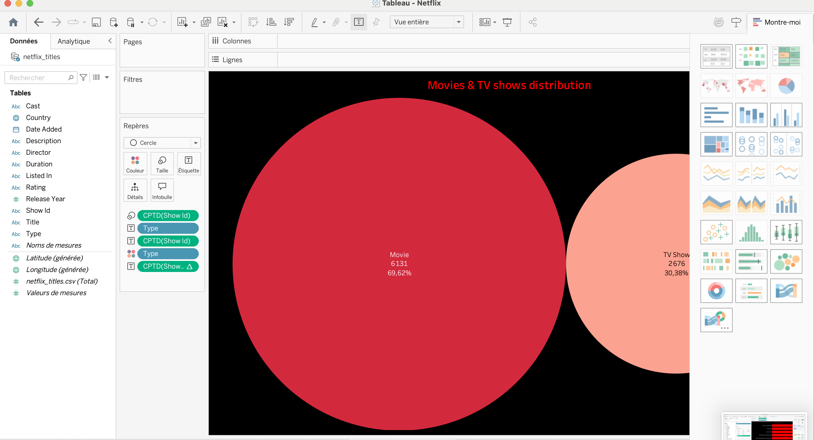
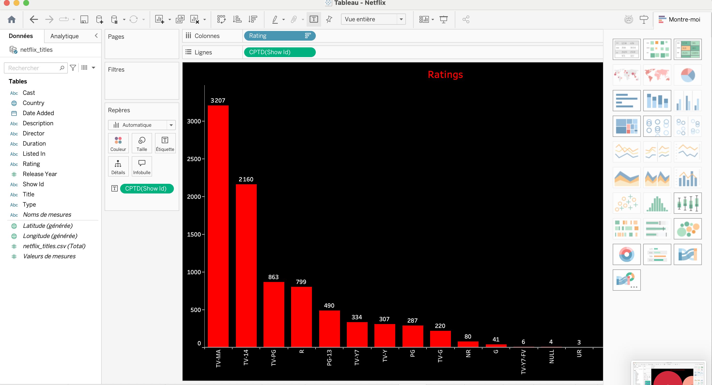

# Netflix Tableau Dashboard

Interactive Tableau dashboard designed to explore and visualize the Netflix catalog.

## Objective

The goal of this project is to analyze Netflix content through an interactive dashboard and identify key trends related to movies, TV shows, genres, ratings, release years and countries.

## Dataset

The workbook is based on a Netflix titles dataset containing information such as:

- Title
- Type
- Genre
- Rating
- Release year
- Date added
- Duration
- Country
- Description

## Dashboard Analysis

The dashboard includes several visual analyses:

- Movies vs TV Shows distribution
- Content by release year
- Top 10 genres
- Content distribution by country
- Ratings analysis
- Duration analysis
- Date added analysis
- Content descriptions and detailed exploration

## Dashboard

### Main Dashboard



## Additional Dashboard Views

### Movies vs TV Shows



### Ratings



### Release Year



### Top Genres



### Country Distribution



## Technologies

- Tableau
- Data Visualization
- Business Intelligence
- Data Analysis

## Skills Demonstrated

- Dashboard design
- Data visualization
- KPI analysis
- Data storytelling
- Interactive filtering
- Trend analysis
- Business Intelligence reporting

## Project Files

```text
netflix-tableau-dashboard/
├── images/
├── Netflix.twbx
├── README.md
└── .gitignore